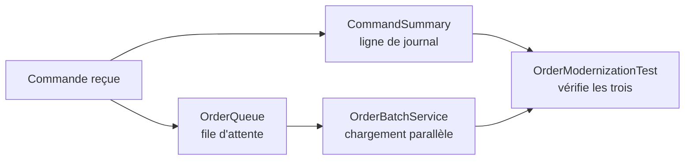

# Ateliers Java 21 à 25

Ce dépôt accompagne la formation « Nouveautés Java 21 à 25 ». Le fil rouge est un petit service de traitement de commandes, volontairement indépendant d'un framework.

## Ce que contient l'application

Une maquette de service de traitement de commandes, réduite à trois classes indépendantes.



Chaque classe est le terrain d'une nouveauté Java :

- `CommandSummary` traduit une commande en ligne de journal, terrain du pattern matching ;
- `OrderQueue` retient des identifiants dans leur ordre d'arrivée, terrain des collections séquencées ;
- `OrderBatchService` charge plusieurs commandes en parallèle, terrain des threads virtuels.

Rien ne tourne : pas de `main` en dehors des tests, pas de framework, pas de base de données, pas de réseau. Chaque TP a un test qui s'exécute sans option et affiche une ligne `OK` ou `ÉCHEC` par vérification.

## Prérequis

- JDK 25 disponible dans le terminal ;
- un éditeur ou un IDE capable d'ouvrir des sources Java ;
- aucun accès réseau requis pendant les TP.

Vérifier l'environnement :

```bash
java -version
```

Puis :

```bash
javac -version
```

## Organisation

```text
exercices/   énoncés et code de départ
data/        inventaire synthétique du TP d'audit
solutions/   résultats de référence, à ne pas ouvrir avant la correction
demos/       exemples courts utilisés par le formateur
scripts/     compilation et vérification sans dépendance externe
```

Les fichiers compilés vont dans `out/`, ignoré par Git. Rien de généré n'est versionné.

## Branches d'étape

La branche `main` porte l'état de départ. Chaque étape du guide a sa branche, qui contient le code tel qu'il doit être à ce moment-là :

```text
main                     état de départ, à cloner
etape-2-switch           le switch exhaustif remplace la chaîne de if instanceof
etape-3-record-pattern   les record patterns sortent les composants
etape-4-refund           RefundOrder est ajoutée, sans case correspondant
```

Pour obtenir l'état d'une étape :

```bash
git switch etape-2-switch
```

**`etape-4-refund` ne compile pas, et c'est voulu.** Elle sert à constater qu'ajouter une commande à une hiérarchie `sealed` casse la compilation à l'endroit exact où une décision manque. N'y lancez pas `verify-all.sh`, il échouerait pour cette raison.

## Progression

1. `tp1-modernisation` : patterns, collections séquencées et threads virtuels ;
2. `tp2-gatherers` : opération intermédiaire personnalisée et fenêtres fixes ;
3. `tp3-contexte` : propagation explicite d'un contexte avec `ScopedValue` ;
4. `tp4-audit` : recommandation argumentée de migration.

## Validation formateur

Depuis la racine du dépôt :

```bash
./scripts/verify-all.sh
```

Le script compile les solutions et les démonstrations avec `--release 25`, puis exécute les tests autonomes avec les assertions activées.

## Garder ou jeter son travail

Avant de changer d'étape, mettre son travail de côté :

```bash
git stash
```

Le récupérer plus tard :

```bash
git stash pop
```

Pour repartir de l'état de référence et **jeter** ce qui n'a pas été commité, sans confirmation :

```bash
git restore .
```

